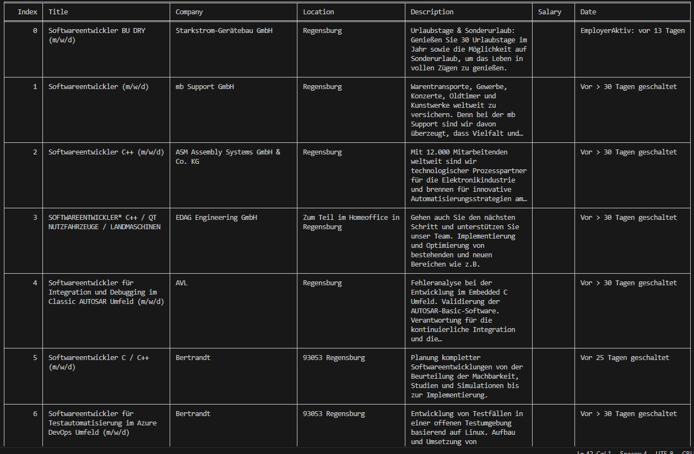

# Indeed Job Scraper

## Welcome! 👋

Thank you for checking out this Indeed Job Scraper. This Python script allows you to scrape job listings from indeed.com based on the provided position and location. The script utilizes the BeautifulSoup library for web scraping, ZenRows for API requests, and tabulate for displaying the results in a tabular format.

## The challenge

The users are able to:

- Enter a position and location
- Request the indeed.com link for a selected job offer
- View the results in a .csv-file

### Built with:

- Python3
- BeautifulSoup library
- Tabulate library
