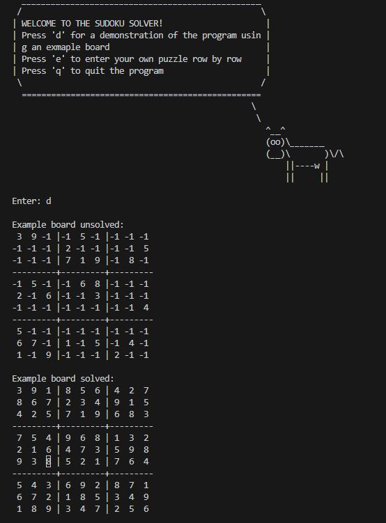

# Sudoku Solver

## Welcome! 👋

Thanks for checking out this simple 9x9 sudoku solver in Pyhton.

## The challenge

The users are be able to:

- See a demo of the program
- Enter their own 9x9 sudoku
- Solve their 9x9 sudoku

### Built with:

- Pyhton3
- Sys, Re, Cowsay Library
