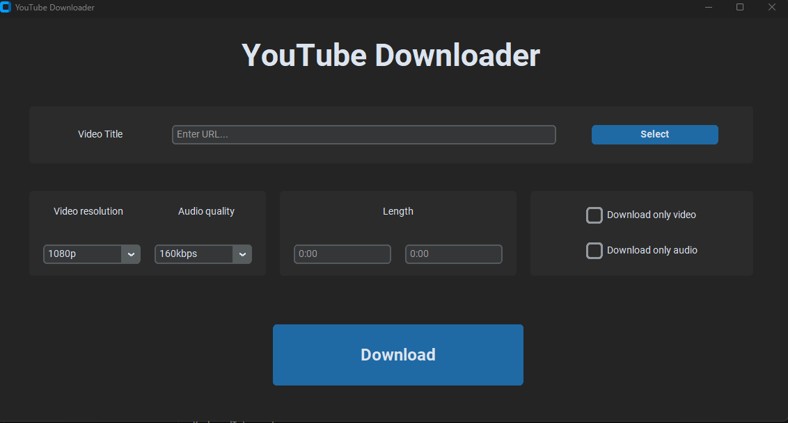

# YouTube video downloader

## Welcome! 👋

Thank you for checking out this simple YouTube video downloader. This Python project provides a simple yet powerful tool to download YouTube videos either through the terminal or a GUI. The project utilizes the pytube library for video downloading and the moviepy library for video editing capabilities.

## The challenge

The users are able to:

- Download YouTube videos via the terminal with various options.
- Download YouTube videos through a user-friendly GUI.
- Choose video and audio qualities before downloading.
- Merge downloaded video and audio files into a single video with audio.

### Built with:

- Python3
- Pytube library
- Moviepy library
- Customtkinter library
